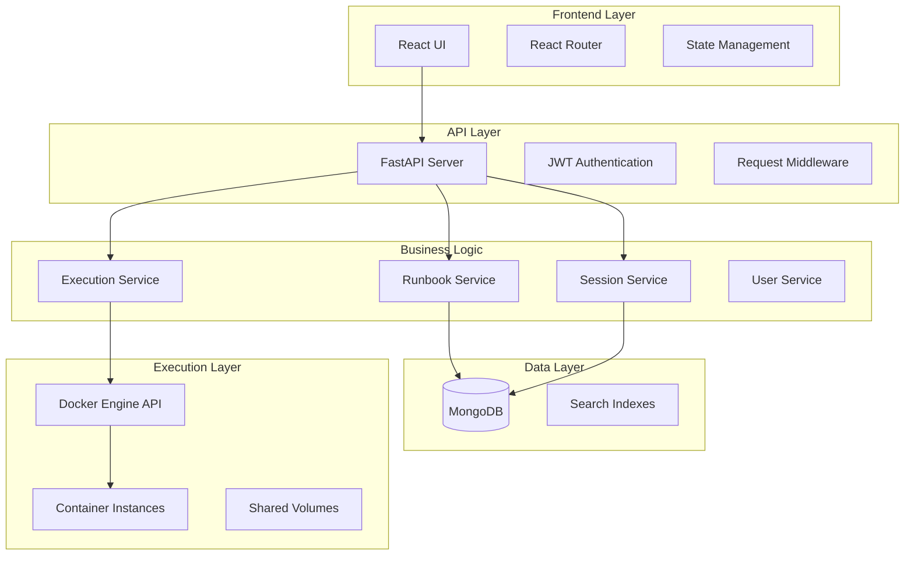

# Design Document

## Overview

The Decision First Runbook App is a full-stack web application that enables teams to create, manage, and execute structured incident response procedures through decision trees. The system emphasizes decision-first thinking by guiding users through critical decision points before presenting procedural steps. The architecture supports containerized execution environments for running commands safely and provides comprehensive session tracking for audit and analysis purposes.

### Key Design Principles

- **Decision-First Approach**: Every runbook starts with decision points that branch into appropriate action paths
- **Containerized Execution**: All runbook commands execute in isolated, user-defined container environments
- **Session-Based Tracking**: Complete audit trails of user decisions and actions during incident response
- **Role-Based Security**: Clear separation between viewers and editors with appropriate access controls
- **Scalable Architecture**: Async-first design supporting concurrent runbook executions

## Architecture

### High-Level Architecture



### Technology Stack

**Backend:**
- **FastAPI**: Async web framework with automatic OpenAPI documentation
- **Motor**: Async MongoDB driver for non-blocking database operations
- **Docker Python SDK**: For container lifecycle management
- **Pydantic**: Data validation and serialization
- **JWT + bcrypt**: Authentication and password security
- **Uvicorn**: ASGI server for production deployment

**Frontend:**
- **React 18**: Component-based UI with hooks and functional components
- **Vite**: Fast build tool with hot module replacement
- **Tailwind CSS**: Utility-first styling framework
- **Framer Motion**: Animation library for interactive elements
- **Axios**: HTTP client with automatic cookie handling
- **React Router**: Client-side routing

**Infrastructure:**
- **MongoDB 7**: Document database with text search capabilities
- **Docker Engine**: Container runtime for execution environments
- **Docker Compose**: Development orchestration
- **Kubernetes**: Production container orchestration

## Components and Interfaces

### Backend Components

#### 1. Runbook Service (`/app/services/runbook_service.py`)

Manages CRUD operations for runbooks and decision trees.

```python
class RunbookService:
    async def create_runbook(self, runbook_data: RunbookCreate) -> Runbook
    async def get_runbook(self, runbook_id: str) -> Optional[Runbook]
    async def update_runbook(self, runbook_id: str, updates: RunbookUpdate) -> Runbook
    async def delete_runbook(self, runbook_id: str) -> bool
    async def search_runbooks(self, query: SearchQuery) -> List[Runbook]
    async def get_runbooks_by_owner(self, owner_id: str) -> List[Runbook]
```

#### 2. Session Service (`/app/services/session_service.py`)

Handles incident session tracking and execution state management.

```python
class SessionService:
    async def create_session(self, runbook_id: str, user_id: str) -> Session
    async def update_session_state(self, session_id: str, state: SessionState) -> Session
    async def log_decision(self, session_id: str, decision: DecisionLog) -> None
    async def log_action(self, session_id: str, action: ActionLog) -> None
    async def get_session_timeline(self, session_id: str) -> List[TimelineEvent]
    async def pause_session(self, session_id: str) -> None
    async def resume_session(self, session_id: str) -> Session
```

#### 3. Execution Service (`/app/services/execution_service.py`)

Manages containerized command execution for runbook steps.

```python
class ExecutionService:
    async def create_execution_environment(self, env_config: ExecutionEnvironment) -> str
    async def execute_command(self, container_id: str, command: str) -> ExecutionResult
    async def get_execution_logs(self, container_id: str) -> List[LogEntry]
    async def cleanup_container(self, container_id: str) -> None
    async def list_active_containers(self) -> List[ContainerInfo]
```

#### 4. User Service (`/app/services/user_service.py`)

Handles authentication, authorization, and user management.

```python
class UserService:
    async def authenticate_user(self, username: str, password: str) -> Optional[User]
    async def create_user(self, user_data: UserCreate) -> User
    async def get_user_by_id(self, user_id: str) -> Optional[User]
    async def update_user_role(self, user_id: str, role: UserRole) -> User
    def create_access_token(self, user_id: str) -> str
    def verify_token(self, token: str) -> Optional[str]
```

### Frontend Components

#### 1. Runbook Viewer (`/src/components/RunbookViewer.tsx`)

Interactive decision tree navigation component.

```typescript
interface RunbookViewerProps {
  runbookId: string;
  sessionId?: string;
  onDecision: (decision: Decision) => void;
  onActionComplete: (action: Action) => void;
}

export const RunbookViewer: React.FC<RunbookViewerProps>
```

#### 2. Runbook Editor (`/src/components/RunbookEditor.tsx`)

Visual editor for creating and modifying decision trees.

```typescript
interface RunbookEditorProps {
  runbook?: Runbook;
  onSave: (runbook: Runbook) => void;
  onCancel: () => void;
}

export const RunbookEditor: React.FC<RunbookEditorProps>
```

#### 3. Session Timeline (`/src/components/SessionTimeline.tsx`)

Displays chronological view of session events and decisions.

```typescript
interface SessionTimelineProps {
  sessionId: string;
  events: TimelineEvent[];
  isLive?: boolean;
}

export const SessionTimeline: React.FC<SessionTimelineProps>
```

#### 4. Execution Console (`/src/components/ExecutionConsole.tsx`)

Real-time display of command execution output and logs.

```typescript
interface ExecutionConsoleProps {
  containerId: string;
  onCommandExecute: (command: string) => void;
  logs: LogEntry[];
}

export const ExecutionConsole: React.FC<ExecutionConsoleProps>
```

## Data Models

### Core Entities

#### Runbook Model

```python
class Runbook(BaseModel):
    id: str = Field(alias="_id")
    title: str
    description: str
    owner_id: str
    severity_level: SeverityLevel
    execution_environment: ExecutionEnvironment
    decision_tree: DecisionTree
    created_at: datetime
    updated_at: datetime
    version: int
    tags: List[str] = []

class DecisionTree(BaseModel):
    root_node: DecisionNode
    nodes: Dict[str, Union[DecisionNode, ActionNode]]

class DecisionNode(BaseModel):
    id: str
    type: Literal["decision"]
    question: str
    description: str
    options: List[DecisionOption]

class ActionNode(BaseModel):
    id: str
    type: Literal["action"]
    title: str
    description: str
    commands: List[Command]
    next_node_id: Optional[str]

class Command(BaseModel):
    command: str
    description: str
    timeout_seconds: int = 300
    expected_exit_codes: List[int] = [0]
```

#### Session Model

```python
class Session(BaseModel):
    id: str = Field(alias="_id")
    runbook_id: str
    user_id: str
    status: SessionStatus
    current_node_id: str
    execution_path: List[str]
    container_id: Optional[str]
    created_at: datetime
    updated_at: datetime
    completed_at: Optional[datetime]

class SessionStatus(str, Enum):
    ACTIVE = "active"
    PAUSED = "paused"
    COMPLETED = "completed"
    FAILED = "failed"

class TimelineEvent(BaseModel):
    id: str
    session_id: str
    event_type: EventType
    timestamp: datetime
    user_id: str
    data: Dict[str, Any]

class EventType(str, Enum):
    SESSION_STARTED = "session_started"
    DECISION_MADE = "decision_made"
    ACTION_EXECUTED = "action_executed"
    COMMAND_RUN = "command_run"
    SESSION_PAUSED = "session_paused"
    SESSION_COMPLETED = "session_completed"
```

#### User Model

```python
class User(BaseModel):
    id: str = Field(alias="_id")
    username: str
    email: str
    hashed_password: str
    role: UserRole
    created_at: datetime
    last_login: Optional[datetime]
    is_active: bool = True

class UserRole(str, Enum):
    VIEWER = "viewer"
    EDITOR = "editor"
    ADMIN = "admin"
```

#### Execution Environment Model

```python
class ExecutionEnvironment(BaseModel):
    name: str
    base_image: str
    dockerfile_content: Optional[str]
    environment_variables: Dict[str, str] = {}
    volumes: List[VolumeMount] = []
    network_mode: str = "bridge"
    resource_limits: ResourceLimits

class ResourceLimits(BaseModel):
    memory_mb: int = 512
    cpu_limit: float = 1.0
    timeout_seconds: int = 3600

class VolumeMount(BaseModel):
    host_path: str
    container_path: str
    read_only: bool = False
```

### Database Schema Design

#### MongoDB Collections

1. **runbooks**: Stores runbook definitions and decision trees
2. **sessions**: Tracks execution sessions and state
3. **timeline_events**: Chronological log of all session events
4. **users**: User accounts and authentication data
5. **execution_logs**: Container execution logs and outputs

#### Indexes

```javascript
// Text search index for runbooks
db.runbooks.createIndex({
  "title": "text",
  "description": "text",
  "tags": "text"
})

// Compound index for runbook queries
db.runbooks.createIndex({
  "owner_id": 1,
  "severity_level": 1,
  "created_at": -1
})

// Session tracking indexes
db.sessions.createIndex({"user_id": 1, "created_at": -1})
db.sessions.createIndex({"runbook_id": 1, "status": 1})

// Timeline events index
db.timeline_events.createIndex({
  "session_id": 1,
  "timestamp": -1
})
```

## Error Handling

### Error Categories

1. **Validation Errors**: Invalid input data, handled by Pydantic models
2. **Authentication Errors**: Invalid credentials, expired tokens
3. **Authorization Errors**: Insufficient permissions for requested operations
4. **Database Errors**: Connection failures, query timeouts, data corruption
5. **Container Errors**: Docker daemon issues, container startup failures
6. **Execution Errors**: Command failures, timeout exceeded, resource limits

### Error Response Format

```python
class ErrorResponse(BaseModel):
    error_code: str
    message: str
    details: Optional[Dict[str, Any]] = None
    timestamp: datetime
    request_id: str
```

### Error Handling Strategy

- **Global Exception Handler**: Catches unhandled exceptions and returns structured error responses
- **Retry Logic**: Automatic retry for transient failures (database connections, container operations)
- **Circuit Breaker**: Prevents cascade failures when external services are unavailable
- **Graceful Degradation**: Fallback behaviors when non-critical features fail

## Testing Strategy

### Backend Testing

#### Unit Tests
- Service layer methods with mocked dependencies
- Data model validation and serialization
- Authentication and authorization logic
- Container management operations

#### Integration Tests
- API endpoint testing with test database
- Database operations with real MongoDB instance
- Docker container lifecycle testing
- End-to-end session execution flows

#### Test Structure
```
tests/
├── unit/
│   ├── services/
│   ├── models/
│   └── utils/
├── integration/
│   ├── api/
│   ├── database/
│   └── containers/
└── fixtures/
    ├── runbooks.json
    ├── users.json
    └── sessions.json
```

### Frontend Testing

#### Component Tests
- React component rendering and interaction
- State management and prop handling
- User event simulation and response
- Accessibility compliance testing

#### E2E Tests
- Complete user workflows (login, create runbook, execute session)
- Cross-browser compatibility testing
- Performance testing under load
- Mobile responsiveness testing

### Testing Tools

- **Backend**: pytest, httpx AsyncClient, pytest-asyncio, testcontainers
- **Frontend**: Jest, React Testing Library, Cypress, Playwright
- **API Testing**: Postman collections, automated API testing
- **Load Testing**: Locust for performance testing

### Continuous Integration

```yaml
# .github/workflows/test.yml
name: Test Suite
on: [push, pull_request]
jobs:
  backend-tests:
    runs-on: ubuntu-latest
    services:
      mongodb:
        image: mongo:7
      docker:
        image: docker:dind
    steps:
      - uses: actions/checkout@v3
      - name: Run backend tests
        run: |
          pip install -r requirements-dev.txt
          pytest tests/ --cov=app

  frontend-tests:
    runs-on: ubuntu-latest
    steps:
      - uses: actions/checkout@v3
      - name: Run frontend tests
        run: |
          npm ci
          npm run test:coverage
          npm run test:e2e
```

This design provides a comprehensive foundation for building the Decision First Runbook App with proper separation of concerns, scalable architecture, and robust error handling. The containerized execution environment ensures safe command execution while the session tracking provides complete audit trails for incident response activities.
